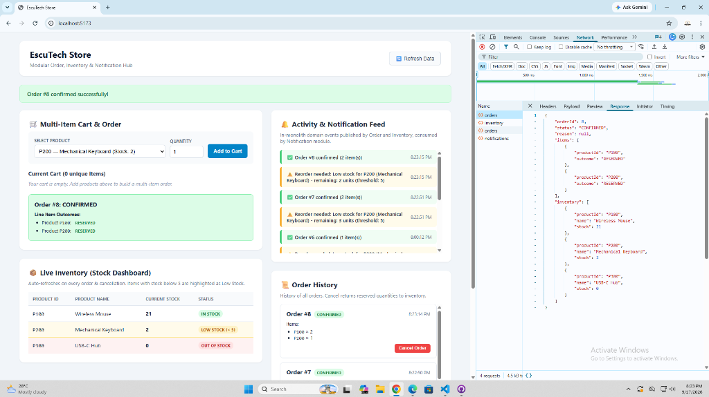
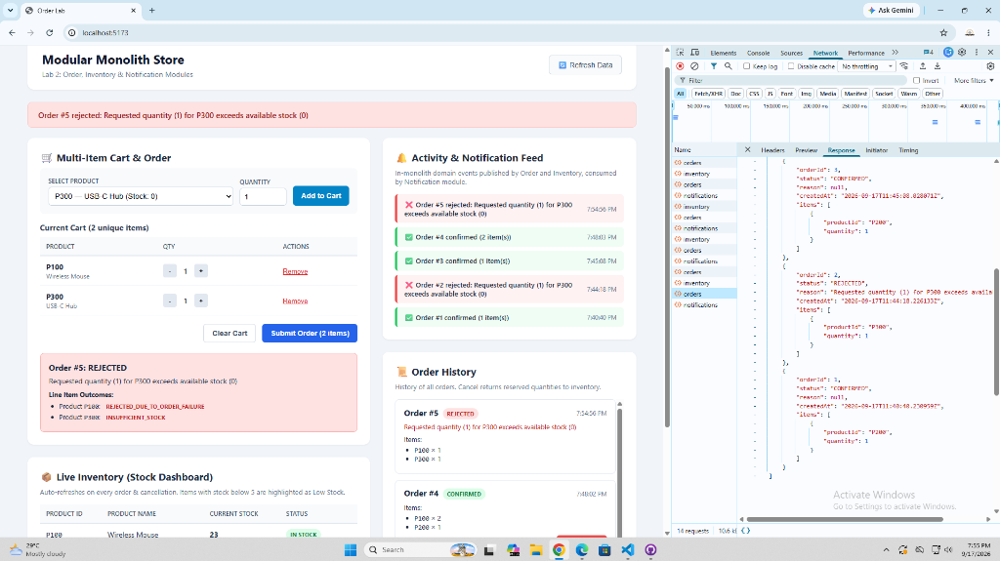

# Modular Monolith: Order + Inventory + Notification (Spring Boot + React + Supabase)

> The package root is `edu.cit.escuzar`.

## Architecture

```
backend/
  src/main/java/edu/cit/escuzar/
    ShopApplication.java            <- @SpringBootApplication, scans all 3 modules
    CorsConfig.java                  <- shared CORS infra (http://localhost:5173)
    shop/                            <- Order module
      Order.java, OrderItem.java     <- JPA entities (orders, order_items)
      OrderRepository.java           <- package-private repository
      OrderService.java              <- public service (all-or-nothing rollback & cancel)
      OrderController.java           <- REST controller (/api/orders, /api/orders/{id}/cancel)
      dto/                           <- OrderRequest, OrderResponse, OrderView, OrderItemOutcome
      event/                         <- OrderPlacedEvent, OrderRejectedEvent, OrderItemDto
    inventory/                       <- Inventory module
      InventoryItem.java             <- JPA entity (inventory)
      InventoryRepository.java       <- package-private repository with pessimistic write lock
      InventoryService.java          <- public interface (the module boundary: reserve, restock, getAllItems)
      InventoryServiceImpl.java      <- package-private implementation
      InventoryController.java       <- REST controller (/api/inventory)
      dto/                           <- InventoryItemView, ReservationResult
      event/                         <- LowStockEvent (published when stock < threshold)
    notification/                    <- Notification module (new in Lab 2)
      Notification.java              <- JPA entity (notifications)
      NotificationRepository.java    <- package-private repository
      NotificationListener.java      <- package-private @EventListener (consumes events)
      NotificationController.java    <- REST controller (/api/notifications)
      dto/                           <- NotificationResponse
frontend/                            <- Vite + React (Multi-item cart, live inventory, order history, activity feed)
sql/schema.sql                       <- Complete recreation script (inventory, orders, order_items, notifications + seed data)
```

### Module Boundary Enforcement
- **Inventory boundary:** `InventoryServiceImpl` and `InventoryRepository` are package-private. `OrderService` only depends on the public `InventoryService` interface and DTOs.
- **Notification boundary:** The `notification` package depends **only** on event records (`OrderPlacedEvent`, `OrderRejectedEvent`, `LowStockEvent`). It never imports or calls `OrderService` or `InventoryService`. Conversely, neither `shop` nor `inventory` imports anything from `edu.cit.escuzar.notification`. Communication is 100% event-driven via Spring's `ApplicationEventPublisher`.

---

## Supabase Setup

1. Log in to [supabase.com](https://supabase.com).
2. In your Supabase dashboard, open the **SQL Editor**, paste the full contents of `sql/schema.sql`, and execute it.
   - This cleanly drops existing tables and creates `inventory`, `orders`, `order_items`, and `notifications`.
   - It seeds `inventory` with `P100` (Wireless Mouse, 25), `P200` (Mechanical Keyboard, 10), and `P300` (USB-C Hub, 0).
3. Under **Project Settings -> Database -> Connection string -> JDBC**, copy your connection string, username, and password.
4. In `backend/.env` (or via environment variables), export:
   ```bash
   SUPABASE_DB_URL=jdbc:postgresql://<host>:5432/postgres
   SUPABASE_DB_USERNAME=postgres
   SUPABASE_DB_PASSWORD=<your-db-password>
   ```

---

## Running the Application

### Backend
```bash
cd backend
# On Linux/macOS:
export $(cat .env | xargs)
./mvnw spring-boot:run
# On Windows (PowerShell):
Get-Content .env | ForEach-Object { $k, $v = $_.Split('=', 2); [System.Environment]::SetEnvironmentVariable($k, $v) }
.\mvnw.cmd spring-boot:run
```
Server starts on `http://localhost:8080`.

To run the automated unit tests:
```bash
.\mvnw.cmd test
```

### Frontend
```bash
cd frontend
npm install
npm run dev
```
Vite dev server starts on `http://localhost:5173`.

---

## Event Listener Concurrency: Synchronous vs `@Async`

In this implementation, `@EventListener` methods in `NotificationListener` run **synchronously** in the caller's thread:
- **Why Synchronous:** In this modular monolith, synchronous listeners execute within the same execution thread and database transaction lifecycle. This guarantees that notifications are immediately consistent and queryable via `GET /api/notifications` as soon as the HTTP request returns to the frontend, with no risk of race conditions or thread pool starvation.
- **Why not `@Async`:** Making listeners `@Async` decouples event execution to background threads so slow notifications (e.g. sending real external emails or SMS) do not delay the client's HTTP response. However, `@Async` listeners require enabling task executors (`@EnableAsync`) and, more critically, require careful transaction synchronization (`@TransactionalEventListener(phase = TransactionPhase.AFTER_COMMIT)`). Otherwise, an asynchronous listener could fire and write a notification for an order that subsequently fails or rolls back in the primary database transaction.

---

## Network Tab Evidence

Capture and paste screenshots or request/response payloads from DevTools Network tab for each of the four scenarios:

### 1. Multi-Item Order Where All Items Succeed (`CONFIRMED`)
- **Action:** Add `P100` (qty 2) and `P200` (qty 1) to cart, then submit order.
- **Endpoint:** `POST /api/orders`
- **Request Body:**
  ```json
  {
    "items": [
      { "productId": "P100", "quantity": 2 },
      { "productId": "P200", "quantity": 1 }
    ]
  }
  ```
- **Response Payload:**
  ```json
  {
    "orderId": 1,
    "status": "CONFIRMED",
    "reason": null,
    "items": [
      { "productId": "P100", "outcome": "RESERVED" },
      { "productId": "P200", "outcome": "RESERVED" }
    ],
    "inventory": [ ... ]
  }
  ```



---

### 2. Multi-Item Order Where One Item Fails (`REJECTED` with All-or-Nothing Rollback)
- **Action:** Add `P100` (qty 1) and `P300` (qty 1, stock is 0) to cart, then submit order.
- **Endpoint:** `POST /api/orders`
- **Request Body:**
  ```json
  {
    "items": [
      { "productId": "P100", "quantity": 1 },
      { "productId": "P300", "quantity": 1 }
    ]
  }
  ```
- **Response Payload:**
  ```json
  {
    "orderId": 2,
    "status": "REJECTED",
    "reason": "Requested quantity (1) for P300 exceeds available stock (0)",
    "items": [
      { "productId": "P100", "outcome": "REJECTED_DUE_TO_ORDER_FAILURE" },
      { "productId": "P300", "outcome": "INSUFFICIENT_STOCK" }
    ],
    "inventory": [ ... ]
  }
  ```


---

### 3. Order Cancellation with Restock Reflected in `GET /api/inventory`
- **Action:** Click "Cancel Order" on a confirmed order in Order History.
- **Endpoints:**
  1. `POST /api/orders/{orderId}/cancel`
     - Response: `200 OK` with order status updated to `CANCELLED`.
  2. `GET /api/inventory`
     - Response: Shows stock for cancelled items incremented back by the reserved quantities.
*(Insert your screenshot of DevTools Network tab showing `cancel` call followed by `GET /api/inventory` with restored stock)*

---

### 4. Notification Feed Showing Confirmed, Rejected, and Low-Stock Alert
- **Action:**
  1. Place a confirmed order.
  2. Place an order exceeding stock to trigger rejection.
  3. Place an order for `P200` with quantity 6 (reducing remaining stock from 10 down to 4, which is below the threshold of 5).
  4. Query `GET /api/notifications`.
- **Response Payload (`GET /api/notifications`):**
  ```json
  [
    {
      "notificationId": 3,
      "message": "Reorder needed: Low stock for P200 (Mechanical Keyboard) - remaining: 4 units (threshold: 5)",
      "createdAt": "..."
    },
    {
      "notificationId": 2,
      "message": "Order #2 rejected: Requested quantity (1) for P300 exceeds available stock (0)",
      "createdAt": "..."
    },
    {
      "notificationId": 1,
      "message": "Order #1 confirmed (2 item(s))",
      "createdAt": "..."
    }
  ]
  ```
*(Insert your screenshot of DevTools Network tab and UI showing all three notification categories)*

---

## Reflection

**1. In-process atomicity vs. distributed multi-item orders.**
Within our monolith, multi-item orders stay completely atomic because `OrderService.placeOrder()` is annotated with Spring's `@Transactional`. Both the Order entities and Inventory entities are accessed within the same JVM thread and managed by the same JPA `EntityManager` over a single PostgreSQL database connection. Before any modification is persisted, an in-memory validation pass checks every requested line item against live stock. If even a single item fails, the entire transaction branches into a rejection without calling `InventoryService.reserve()`. Furthermore, if an unexpected runtime failure occurred midway through reservation, the database engine would roll back all writes automatically as an ACID unit. If Order and Inventory were decoupled into separate microservices communicating over HTTP or gRPC, single-database ACID guarantees would vanish. We would need to implement an orchestrated or choreographic Saga pattern. The Order service would invoke a reservation endpoint on Inventory. In the event of a partial failure, network timeout, or downstream rejection, the orchestrator would be required to trigger compensating transactions (such as issuing explicit `restock` calls for previously reserved line items). This architecture demands idempotent endpoints, transaction logs, and eventual consistency handling.

**2. Event publishing vs. direct calling and microservice decoupling.**
Publishing domain events (`OrderPlacedEvent`, `OrderRejectedEvent`, `LowStockEvent`) via Spring's `ApplicationEventPublisher` decouples `OrderService` and `InventoryService` from `Notification` at compile time and runtime. `OrderService` simply broadcasts an immutable record of what occurred; it contains zero imports from `edu.cit.escuzar.notification`, knows nothing of notification database tables, and does not depend on whether notifications succeed. The Notification module subscribes via `@EventListener`, acting purely as an observer. If Notification were moved to a distinct microservice, Spring's in-memory event bus would need to be replaced with a distributed message broker such as RabbitMQ or Apache Kafka. To guarantee that events are not lost if the network or broker is temporarily unavailable, the Transactional Outbox pattern would be required in the publishing service. Additionally, the standalone Notification service would need at-least-once message delivery, consumer deduplication (idempotency based on event/order ID), and dead-letter queues to isolate unprocessable events.

**3. Selecting a module for microservice extraction.**
If forced to extract exactly one module first, I would choose the **Notification** module. Notification is inherently an asynchronous, non-critical domain: while failure to process an order or deduct inventory halts core commerce, a delayed or failed customer notification does not corrupt business state or prevent order completion. Because neither Order nor Inventory imports or depends on Notification, extracting it incurs zero ripple effects on checkout transactions. In contrast, extracting Inventory would immediately shatter single-database transactions and force complex distributed Sagas across checkout. To extract Notification into its own microservice, the required code changes are straightforward: (1) move the `edu.cit.escuzar.notification` package into a new Spring Boot application backed by its own database schema, (2) replace Spring’s in-memory `ApplicationEventPublisher` calls in Order and Inventory with publishing events to a message queue or Kafka topic, and (3) update `NotificationListener` to use `@KafkaListener` or `@RabbitListener` instead of Spring's local `@EventListener`.
